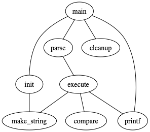
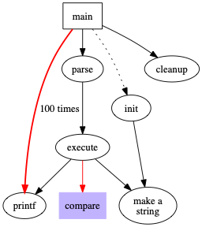
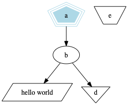
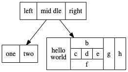
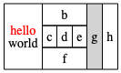
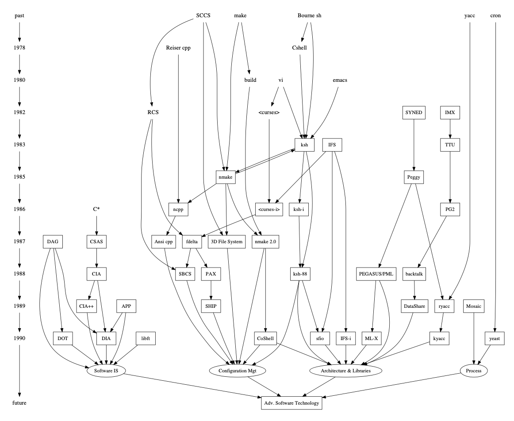
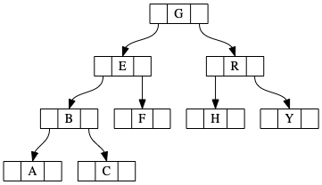
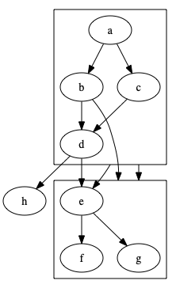

# Hướng dẫn vẽ graph bằng graphviz
BS. Vương Kiến Thanh

**Graphviz** là một trong những phần mềm vẽ graph tốt nhất hiện nay.  
**dot language** là ngôn ngữ để vẽ graph.  
*Graphviz* có thể vẽ được nhiều layouts qua các commands:
- circo
- dot
- fdp
- neato
- osage
- patchwork
- sfdp
- twopi

Trong đó, thông dụng nhất là `dot` và `neato`. Cả 2 đều có thể vẽ *directed graph* và *undirected graph*, gọi tắt là `digraph` và `graph` .   
`dot`: vẽ graph có phân tầng.  
`neato`: vẽ graph để có tổng chiều dài các edges là nhỏ nhất.

Ví dụ:
- dot language `graph`
```
graph G {
    main -- parse -- execute;
    main -- init;
    main -- cleanup;
    execute -- make_string;
    execute -- printf;
    init -- make_string;
    main -- printf
    execute -- compare;
}
```
- dot language `digraph`
```
digraph G {
main -> parse -> execute;
main -> init;
main -> cleanup;
execute -> make_string;
execute -> printf;
init -> make_string;
main -> printf
execute -> compare;
}
```
- Hình output từ `dot` và `graph`

- Hình output từ `neato` và `digraph`


# Tôi chỉ viết về `dot`, các command khác cũng tương tự về dot language và command line options
[Bài viết được dịch từ dot tutorial trên graphviz.com][1]  
## 1. Nguyên lý hoạt động
`dot` dùng để vẽ `digraph`. Phần mềm đọc những thuộc tính của graph trong file input text, sau đó xuất file graph hoặc các định dạng khác như GIF, PNG, SVG, PDF, or PostScript.  

`dot` vẽ graph trong 4 pha. Biết điều này sẽ giúp bạn kiểm soát được layout của graph. Quy trình tạo layout của `dot` dựa vào nguyên tắc graph là acyclic ( không xoay vòng). 
1. Phá vòng trong graph được nhập bằng cách đảo chiều nội tại tại một số edges.
2. Gán rank cho các nodes.
3. Gán order cho các nodes cùng rank để tránh các edges bị cắt ngang.
4. Làm nhỏ và cong các edges

Input text phải dùng **dot language**. Ngôn ngữ này mô tả 3 đối tượng: graphs, nodes, edges. Vì `dot` tạo layout cho `digraph`, nên các ví dụ sau đều dùng `digraph`. Trong graph chính, `subgraph` là một tập hợp con chứa nodes và edges.

[Grammar của **dot language**][3]

`dot` hoạt động trong môi trường cmd/terminal. Ví dụ:  
`$dot -Tpng graph1.gv -o dotgraph1.png`  

Trong đó:
- Tpng: command line option để output file png
- graph1.gv: tên file input
- dotgraph1.png: tên file output

[Command line options documentation][2]. Vì các commands là từ một phần mềm chung nên các options có thể dùng được cho tất cả commands.

Ta có thể tuỳ chỉnh hình thức và vị trí của các nodes và edges trong layout, bằng cách thêm các attributes cho graphs, nodes, edges, subgraphs. Attributes là một cặp name-value chứa chuỗi ký tự.  
Ví dụ:

```
digraph G {
    size ="4,4";
    main [shape=box]; /* this is a comment */
    main -> parse [weight=8];
    parse -> execute;
    main -> init [style=dotted];
    main -> cleanup;
    execute -> { make_string; printf}
    init -> make_string;
    edge [color=red]; // so is this
    main -> printf [style=bold,label="100 times"];
    make_string [label="make a\nstring"];
    node [shape=box,style=filled,color=".7 .3 1.0"];
    execute -> compare;
    }
```



Trong ví dụ, line 2 là attr của graph, tuỳ chỉnh kích thước của graph thành (4,4) inches. Attr của nodes và edges được để trong dấu ngoặc vuông [ ].  
Line 3: Shape của main thành hình hộp.  
Line 4: Edge main->parse được làm thẳng bằng attr weight, default là 1.  
Line 6: Edge main->init là đường dotline.  
Line 8: Node execute tới cùng lúc 2 nodes make_string và printf.  
Line 10: Edges mặc định là màu đỏ. Chỉ ảnh hưởng các edges được tạo tiếp theo.  
Line 11: Làm edge đậm và gắn label '100 times'.   
Line 12: Node được gắn label nhiều dòng.  
Line 13: Node mặc định hình hộp, được đổ màu xanh dương. Node compare bắt đầu được áp dụng attr.


## 2. Các Attributes

[Tổng hợp các attributes][4]

### a. Node shapes
Mặc định, nodes có attr: `shape=ellipse, width=.75, height=.5` và label là tên node. Một số shapes thông dụng khác như `box`, `circle`, `record` và `plaintext`. `plaintext` là 1 shape rất thú vị vì nó không có viền ngoài, là 1 dạng shape quan trọng trong một số dạng diagram. Một số graph có kích thước lớn, `point` có thể giúp các nodes nhỏ lại để hiện thông tin tối thiểu. Khi vẽ, nodes thay đổi kích thước để chứa tên node, nếu không có đặt `fixedsize=true`, trong trường hợp đó chiều cao và chiều rộng được cố định.  

Nodes shape chia thành 2 nhóm: polygon và record.  

[Tổng hợp node shapes][5]

Tất cả các shape ngoại trừ `record` và `Mrecord` là polygon. Hình tròn và ellipes là polygons đặc biệt.


<table align="CENTER">
  <tbody><tr align="CENTER">
    <td>
    </td><td>
    </td><td>
    </td><td>
  </td></tr>
  <tr align="CENTER">
    <td><a name="d:box">box</a>
    </td><td><a name="d:polygon">polygon</a>
    </td><td><a name="d:ellipse">ellipse</a>
    </td><td><a name="d:oval">oval</a>
  </td></tr>
  <tr align="CENTER">
    <td>
    </td><td>
    </td><td>
    </td><td>
  </td></tr>
  <tr align="CENTER">
    <td><a name="d:circle">circle</a>
    </td><td><a name="d:point">point</a>
    </td><td><a name="d:egg">egg</a>
    </td><td><a name="d:triangle">triangle</a>
  </td></tr>
  <tr align="CENTER">
    <td>
    </td><td>
    </td><td>
    </td><td>
  </td></tr>
  <tr align="CENTER">
    <td><a name="d:plaintext">plaintext</a>
    </td><td><a name="d:plain">plain</a>
    </td><td><a name="d:diamond">diamond</a>
    </td><td><a name="d:trapezium">trapezium</a>
  </td></tr>
  <tr align="CENTER">
    <td>
    </td><td>
    </td><td>
    </td><td>
  </td></tr>
  <tr align="CENTER">
    <td><a name="d:parallelogram">parallelogram</a>
    </td><td><a name="d:house">house</a>
    </td><td><a name="d:pentagon">pentagon</a>
    </td><td><a name="d:hexagon">hexagon</a>
  </td></tr>
  <tr align="CENTER">
    <td>
    </td><td>
    </td><td>
    </td><td>
  </td></tr>
  <tr align="CENTER">
    <td><a name="d:septagon">septagon</a>
    </td><td><a name="d:octagon">octagon</a>
    </td><td><a name="d:doublecircle">doublecircle</a>
    </td><td><a name="d:doubleoctagon">doubleoctagon</a>
  </td></tr>
  <tr align="CENTER">
    <td>
    </td><td>
    </td><td>
    </td><td>
  </td></tr>
  <tr align="CENTER">
    <td><a name="d:tripleoctagon">tripleoctagon</a>
    </td><td><a name="d:invtriangle">invtriangle</a>
    </td><td><a name="d:invtrapezium">invtrapezium</a>
    </td><td><a name="d:invhouse">invhouse</a>
  </td></tr>
  <tr align="CENTER">
    <td>
    </td><td>
    </td><td>
    </td><td>
  </td></tr>
  <tr align="CENTER">
    <td><a name="d:Mdiamond">Mdiamond</a>
    </td><td><a name="d:Msquare">Msquare</a>
    </td><td><a name="d:Mcircle">Mcircle</a>
    </td><td><a name="d:rect">rect</a>
  </td></tr>
  <tr align="CENTER">
    <td>
    </td><td>
    </td><td>
    </td><td>
  </td></tr>
  <tr align="CENTER">
    <td><a name="d:rectangle">rectangle</a>
    </td><td><a name="d:square">square</a>
    </td><td><a name="d:star">star</a>
    </td><td><a name="d:none">none</a>
  </td></tr>
  <tr align="CENTER">
    <td>
    </td><td>
    </td><td>
    </td><td>
  </td></tr>
  <tr align="CENTER">
    <td><a name="d:underline">underline</a>
    </td><td><a name="d:cylinder">cylinder</a>
    </td><td><a name="d:note">note</a>
    </td><td><a name="d:tab">tab</a>
  </td></tr>
  <tr align="CENTER">
    <td>
    </td><td>
    </td><td>
    </td><td>
  </td></tr>
  <tr align="CENTER">
    <td><a name="d:folder">folder</a>
    </td><td><a name="d:box3d">box3d</a>
    </td><td><a name="d:component">component</a>
    </td><td><a name="d:promoter">promoter</a>
  </td></tr>
  <tr align="CENTER">
    <td>
    </td><td>
    </td><td>
    </td><td>
  </td></tr>
  <tr align="CENTER">
    <td><a name="d:cds">cds</a>
    </td><td><a name="d:terminator">terminator</a>
    </td><td><a name="d:utr">utr</a>
    </td><td><a name="d:primersite">primersite</a>
  </td></tr>
  <tr align="CENTER">
    <td>
    </td><td>
    </td><td>
    </td><td>
  </td></tr>
  <tr align="CENTER">
    <td><a name="d:restrictionsite">restrictionsite</a>
    </td><td><a name="d:fivepoverhang">fivepoverhang</a>
    </td><td><a name="d:threepoverhang">threepoverhang</a>
    </td><td><a name="d:noverhang">noverhang</a>
  </td></tr>
  <tr align="CENTER">
    <td>
    </td><td>
    </td><td>
    </td><td>
  </td></tr>
  <tr align="CENTER">
    <td><a name="d:assembly">assembly</a>
    </td><td><a name="d:signature">signature</a>
    </td><td><a name="d:insulator">insulator</a>
    </td><td><a name="d:ribosite">ribosite</a>
  </td></tr>
  <tr align="CENTER">
    <td>
    </td><td>
    </td><td>
    </td><td>
  </td></tr>
  <tr align="CENTER">
    <td><a name="d:rnastab">rnastab</a>
    </td><td><a name="d:proteasesite">proteasesite</a>
    </td><td><a name="d:proteinstab">proteinstab</a>
    </td><td><a name="d:rpromoter">rpromoter</a>
  </td></tr>
  <tr align="CENTER">
    <td>
    </td><td>
    </td><td>
  </td></tr>
  <tr align="CENTER">
    <td><a name="d:rarrow">rarrow</a>
    </td><td><a name="d:larrow">larrow</a>
    </td><td><a name="d:lpromoter">lpromoter</a>
  </td></tr>
</tbody></table>

Polygon có một số attr:
- `regular`: hình đều, các góc bằng nhau.
- `peripheries`: số đường viền.
- `orientation`: góc xoay theo chiều kim đồng hồ. 

Shape `polygon` có thể tạo shape chưa xác định trước. Nó có thêm các attr: `sides`, `skew` và `distortion`.  

```
digraph G {
    a -> b -> c;
    b -> d;
    a [shape=polygon, sides=5, peripheries=3, color=lightblue, style=filled];
    c [shape=polygon, sides=4, skew=.4, label="hello world"]
    d [shape=invtriangle];
    e [shape=polygon, sides=4, distortion=.7];
}
```


Shape nhóm record chỉ có 2 shapes: `record` và `Mrecord`. 2 shape này giống như ngoại trừ `Mrecord` thì được làm tròn góc. Node có hình dạng hình hộp ngang và dọc xếp chồng lên nhau, thể hiện danh sách liệt kê các nội dung. Nó được định dạng trong attr `label` với cấu trúc sau: 
```
rlabel → field ( ’|’ field )*
field → boxLabel | ’’ rlabel ’’
boxLabel → [ ’<’ string ’>’ ] [ string ]
```
Ví dụ:
```
digraph structs {
node [shape=record];
    struct1 [shape=record,label="<f0> left|<f1> mid\ dle|<f2> right"];
    struct2 [shape=record,label="<f0> one|<f1> two"];
    struct3 [shape=record,label="hello\nworld |{ b |{c|<here> d|e}| f}| g | h"]; 
    struct1 -> struct2;
    struct1 -> struct3;
 }
```


### b. Label
Mặc định label là tên của của nodes và edges. Ta có thay đổi label của nodes và edges bằng attr `label`. Ta có thể viết label nhiều dòng bằng cách thêm `\n`.   

Graph và subgraph có thể có label, mặc định label của graph ở dưới và giữa graph, label của subgraph ở trên và trái của subgraph được đóng khung. Để thay đổi vị trí label của graph và subgraph, ta dùng `labelloc` và `labeljust`. `labelloc=t` là ở trên, `labelloc=b` là ở dưới, `labeljust=r` là bên phải.

Font mặc định là 14-point Times-Roman, black. Có thể thay đổi bằng attr `fontname`, `fontsize` và `fontcolor`. Fontname tuỳ thuộc vào hệ thống, tốt nhất nên dùng dòng font Times, Helvetica, Courier or Symbol vì chúng tương thích với nhiều hệ thống.

Edge labels được đặt ở chính giữa edge. Thông thường, label được đặt để tránh chồng lắp edges với nodes, điều này có thể khó khăn trong những graph phức tạp. Nếu `decorate=true`, một đường thẳng được vẽ từ label đến edge. Một số trường hợp, hình được vẽ to ra dể tránh chồng edges với edge labels, ta có thể `labelfloat=true` để không cần điều này và làm hình gọn hơn.

Ta có thêm label ở 2 đầu edge bằng `headlabel` và `taillabel`. Label có thể tuỳ biến bằng `labelfontname`, `labelfontsize`, `labelfontcolor`. `labelangle` để chính góc xoay và `labeldistance` là hệ số khoảng cách từ label đến node.

### c. HTML-like labels
Chúng ta có thể làm giàu thêm các labels bằng cách thêm các tag HTML vào như `<font>`, `<b>`,...  
Bằng cách dùng tag `<table>`, ta có thể mở rộng và thay thế node có `shape=record`. Attribute `port` trong tag `<td>` có thể đùng làm port name của ô trong bảng. Khi dùng tag `<table>`, ta thường đặt `shape=None, margin=0`.
```
digraph html {
    abc [shape=none, margin=0, label=<
<TABLE BORDER="0" CELLBORDER="1" CELLSPACING="0" CELLPADDING="4">
    <TR><TD ROWSPAN="3"><FONT COLOR="red">hello</FONT><BR/>world</TD> 
        <TD COLSPAN="3">b</TD>
        <TD ROWSPAN="3" BGCOLOR="lightgrey">g</TD>
        <TD ROWSPAN="3">h</TD>
    </TR>
    <TR><TD>c</TD>
        <TD PORT="here">d</TD>
         <TD>e</TD>
    </TR>
    <TR><TD COLSPAN="3">f</TD>
    </TR>
</TABLE>>];
}
```


### d. Styles
Nodes và edges mặc định attr `color` là black. `color` có value là HSB, RGB, tên màu. Ví dụ như "orchid", "0.8396,0.4862,0.8549", "#DA70D6" vẽ cùng 1 màu.

`style` kiểm soát nhiều đặc tính của nodes và edges. Value của `style` là một chuỗi các styles cách nhau bằng dấu phảy. Một số style chung là `solid`, `dashed`, `dotted`, `bold` và `invis`.  

Nodes có thêm: `filled`, `diagonals` và `rounded`. `filled` làm đầy node bằng màu từ attr `fillcolor`, nếu không có thì lấy từ `color`, mặc định là màu xám.  

Edges có attr `dir`: `forward` (mặc định), `back`, `both`, `none`. `arrowhead` và `arrowtail` để chọn style cho 2 đầu edge: `normal`, `inv`, `dot`, `invdot`, `odot`, `invodot`, `none`. `arrowsize` để chỉnh kích thước edge.

Background của graph được chọn màu bới `bgcolor`.

### e. Chiều đứng nằm, kích thước, cách dòng của graph
- `nodesep`: Khoảng cách giữa 2 nodes cùng rank.  
- `ranksep`: Khoảng cách giữa 2 rank. `ranksep=equally` thì các rank cách đều nhau. Ví dụ `ranksep= 2.0 equally` làm cho rank cách đều 2 inches.  

Kích thước tự nhiên của hình ảnh xuất ra sẽ to khi graph to, đôi khi in không được hoặc không chèn hình vào document được. `size` và `ratio` kiểm soát chuyện kích thước. `size="x,y"`; `ratio` có thể là 1 con số, `fill`, `compress`, `auto` .  
`page` để mô tả kích thước giấy in (inches), phổ biến là `page="8.5,11"`. `margin` để mô tả phần in không được của máy in.  
`orientation=landscape` để graph nằm ngang.

### f. Vị trí nodes và edges
`rankdir=LR` để các tầng theo chiều trái phải thay vì trên dưới. Value khác như `TB` (mặc định), `BT`, `RL`.   

Trong graph có timeline hoặc nhấn mạch rank sink và source node, ta có thể đặt `rank` trong subgraph bằng value `same`, `min`, `max`, `source` và `sink`. `rank=same` để các node trong subgraph cùng rank với nhau, `rank=min` để nodes ở rank thấp nhất, `rank=source` cũng để nodes ở rank thấp nhất và không chứa rank khác ngoài min và source. `rank=max` và `rank=sink` để nodes ở rank cao nhất. Các subgraph có node bị share ở nhiều rank khác nhau sẽ được để chung 1 rank.  



Để giữ nguyên thứ tự của nodes như trong input file, ta dùng `ordering=out` cho graph, subgraph. 

Có nhiều cách để thay đổi layout của nodes và edges. `group` để nhóm các nodes và edges lại.  `weight` của edge càng lớn thì các nodes càng gần. Edge có `weight` lớn và `style="invis"` để exploit cho nodes gần nhau. 

Endpoint của edges cùng một node có thể để chung bằng `samehead` và `sametail`.  

Trong pha xếp rank các nodes, node ở đầu edge có rank cao hơn node ở cuối edge. Để không bắt buộc chuyện này, ta dùng `constraint=false`.  

Một số trường hợp, ta không muốn cho đuôi edge quá gần node, ta đặt `minlen`. `minlen=2` thì 2 nodes cách nhau có 1 rank chen ngang.

## 3. Các tính năng cao cấp
### a. port
port là nơi bám của edge trong 1 node. Mặc định là port sẽ ở trung tâm của node, và bị cắt nang ở viền của node.



### b. cluster
cluster là subgraph có trên bắt đầu bằng `cluster`, và được đóng khung khi vẽ graph. Có thể tuỳ chỉnh bằng `fillcolor`, `style="filled"`.

Nếu toplevel graph có `compound=true`, `dot` có thể vẽ edge nối các nodes và clustes bằng `lhead` và `ltail`



### c. concentration
`concentration=true` ở toplevel graph sẽ cho phép các edge gộp chung lại khi graph quá phức tạp

## 4. Khác
Toplevel graph có thể `strict digraph` hoặc `strict graph` để bắt buộc với 2 nodes chỉ có 1 edge. Những edge bị trùng sau sẽ áp attr lên edge cũ.  

Graph, node, edge có thể có attr `URL` để sử dụng trong một số đuôi file `(ps2, imap, cmapx, or svg)` để nhúng link vào. 

Một số dạng file như `svg, fig,..` ta có thể cho `comment` vào.

# Tổng kết
`dot` dùng để vẽ graph phân tầng rất đẹp và có thể dùng trong nhiều tình huống. Thuật toán của `dot` rất hiệu quả nên ta có nền tảng cứng để phát triển thuật toán vẽ graph lớn và có tính tương tác.

# References
1. `dot` tutorials. [1]
2. `dot` and others command line options. [2]
3. dot language grammar [3]
4. Tổng hợp các attributes [4]
5. Node shapes [5]
6. Arrow shapes [6]
7. Color [7]
8. Output formats [8]


[1]: https://graphviz.gitlab.io/_pages/pdf/dotguide.pdf
[2]: https://graphviz.gitlab.io/_pages/doc/info/command.html
[3]: https://graphviz.gitlab.io/_pages/doc/info/lang.html
[4]: https://graphviz.gitlab.io/_pages/doc/info/attrs.html
[5]: https://graphviz.gitlab.io/_pages/doc/info/shapes.html
[6]: https://graphviz.gitlab.io/_pages/doc/info/arrows.html
[7]: https://graphviz.gitlab.io/_pages/doc/info/colors.html
[8]: https://graphviz.gitlab.io/_pages/doc/info/output.html